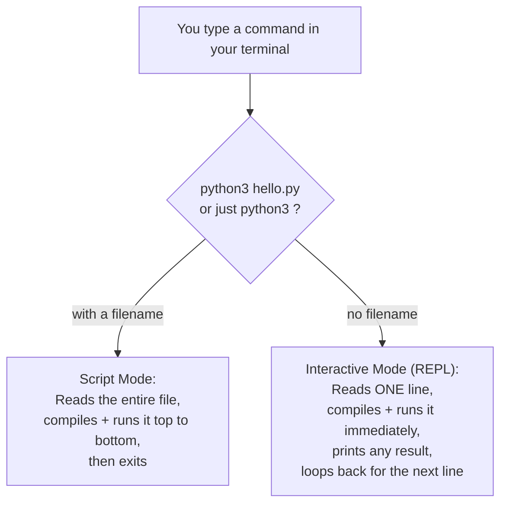
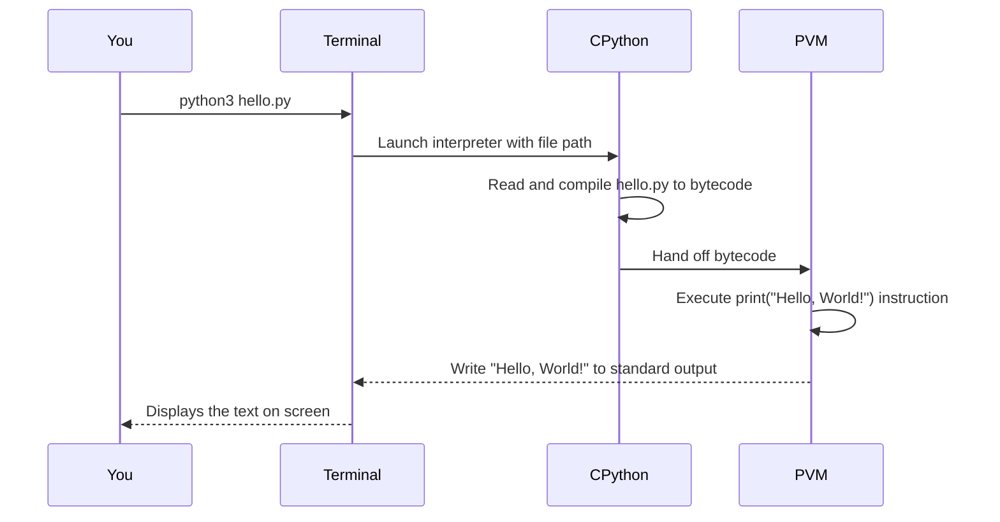

# 👋 03 - Hello World

> 🟢 Difficulty: Beginner | ⏱️ Estimated time: 30–40 minutes

---

## 📌 What is it?

"Hello, World!" is the traditional first program written when learning any new programming language — a tiny program whose only job is to display the text `Hello, World!` on the screen. It's a rite of passage, but it's also genuinely useful: it proves that your entire toolchain (interpreter installed correctly, file saved correctly, terminal command correct) actually works, *before* you try to write anything more complex.

In Python, it's famously simple:

```python
print("Hello, World!")
```

This chapter goes far beyond that one line — you'll learn **two different ways to run Python code** (scripts vs. the interactive shell), what a `.py` file actually is, and the special `__name__ == "__main__"` pattern used in almost every real Python project.

---

## 🤔 Why do we need it?

Before writing anything meaningful, you need to answer three basic questions:
1. **Where do I write Python code?** (a plain text file, or an interactive prompt)
2. **How do I run it?** (which terminal command)
3. **How do I know it worked?** (seeing expected output)

"Hello, World!" answers all three with the smallest possible program, isolating "did my setup work?" from "did my logic work?" — a critical debugging skill you'll use for your entire programming career: **always verify the simplest possible case first.**

---

## 🌍 Real-Life Analogy

Think of "Hello, World!" like turning the ignition key on a car you just bought, before driving anywhere. You're not testing whether you can navigate to a destination (that's later, more complex code) — you're testing whether the engine starts at all. If the engine doesn't start, there's no point worrying about your route.

---

## 🧾 Syntax

### Method 1: Running a script file

Create a file named `hello.py`:
```python
print("Hello, World!")
```

Run it from your terminal:
```bash
python3 hello.py
```

**Output:**
```
Hello, World!
```

### Method 2: The interactive shell (REPL)

Type `python3` alone in your terminal (no filename) to enter Python's **interactive shell**, also called the **REPL** (Read-Eval-Print Loop):

```bash
$ python3
Python 3.12.4 (main, ...)
>>> print("Hello, World!")
Hello, World!
>>> 2 + 2
4
>>> exit()
```

---

## ⚙️ How It Works Internally

### 1. Script mode vs. Interactive (REPL) mode



**REPL** stands for **R**ead → **E**val(uate) → **P**rint → **L**oop. Every line you type is immediately read, compiled to bytecode, executed by the PVM, and — if it produces a value — printed automatically (this is why typing `2 + 2` alone in the REPL shows `4`, but the same line inside a script file would compute `4` and silently discard it, since a script only shows what you explicitly `print()`).

### 2. What actually happens when you run `python3 hello.py`



### 3. The `__name__ == "__main__"` pattern

Every Python module (file) has a built-in variable called `__name__`. When you run a file **directly**, Python sets `__name__` to the string `"__main__"`. When that same file is **imported** by another file instead, `__name__` is set to the module's actual name instead.

```python
# hello.py
def main():
    print("Hello, World!")

if __name__ == "__main__":
    main()
```

This pattern lets a file work both as a standalone script *and* as an importable module, without accidentally running its "script behavior" when someone else imports it. We'll use this pattern constantly starting in later chapters (especially Chapter 19 - Modules & Packages).

---

## 💻 Examples

### 🟢 Simple Example
```python
print("Hello, World!")
```
**Output:**
```
Hello, World!
```

---

### 🟡 Intermediate Example — Multiple print calls and separators
```python
print("Hello,", "World!")
print("Hello, World!", end="")
print(" Still on the same line.")
print("A", "B", "C", sep=" -> ")
```
**Output:**
```
Hello, World!
Hello, World! Still on the same line.
A -> B -> C
```
*Line-by-line:* `print()` accepts multiple arguments separated by commas and joins them with a space by default. The `end` parameter controls what's printed *after* the text (default is a newline `\n`; here we override it to an empty string). The `sep` parameter controls what goes *between* multiple arguments (default is a space; here we use `" -> "`).

---

### 🔴 Advanced Example — Script vs. importable module behavior
```python
# greeter.py
def main():
    print("Hello, World! (running as a script)")

print(f"This module's __name__ is: {__name__}")

if __name__ == "__main__":
    main()
```

**Run directly:**
```bash
python3 greeter.py
```
**Output:**
```
This module's __name__ is: __main__
Hello, World! (running as a script)
```

**Imported from another file** (`use_greeter.py`):
```python
import greeter
```
**Output:**
```
This module's __name__ is: greeter
```
*Explanation:* Notice `main()` never runs when imported — only the top-level `print(f"...")` line runs immediately upon import, because the `if __name__ == "__main__":` guard evaluates to `False` in that context.

---

### 🌐 Real-World Example
Nearly every real Python project — from a two-line script to a massive framework like Django — uses the `if __name__ == "__main__":` pattern in its entry-point file, so the same file can be safely imported for testing or reuse elsewhere without triggering unwanted side effects.

---

## ⚠️ Common Errors (Beginners)

| Mistake | Example | Why it fails | Fix |
|---|---|---|---|
| Forgetting quotes around text | `print(Hello, World!)` | Python thinks `Hello` and `World` are variable names, not text | `print("Hello, World!")` |
| Wrong file extension | Saving as `hello.txt` instead of `hello.py` | `python3` expects a `.py` file (though it will technically still try to run any text file passed to it, using `.py` is the convention and avoids editor/tooling confusion) | Save as `hello.py` |
| Running the file from the wrong folder | `python3 hello.py` from a different directory | Terminal can't find a file that isn't in the current working directory | `cd` into the correct folder first, or provide the full/relative path |
| Confusing REPL auto-printing with `print()` | Expecting a script to show `2 + 2` results without `print()` | Only the REPL auto-prints expression results; script files do not | Explicitly use `print()` in scripts |
| Forgetting to close the REPL properly | Ctrl+C repeatedly instead of `exit()` | Works but is messier | Type `exit()` or press Ctrl+D (macOS/Linux) / Ctrl+Z then Enter (Windows) |

---

## ✅ Best Practices

1. **Use script files for anything beyond quick experiments** — the REPL is great for testing one-liners, not for real programs.
2. **Always wrap your program's entry logic in `if __name__ == "__main__":`** once you start writing multi-purpose files.
3. **Use `print()`'s `sep` and `end` parameters** instead of manually concatenating strings with `+` when formatting output.
4. **Name your files descriptively** (`hello.py`, not `test1.py`) — this matters more as your project grows.
5. **Run your script immediately after writing it** — don't stack up ten changes before your first test run.

---

## 🚫 When NOT to Use the REPL

- For anything you need to **save and reuse** — the REPL's history disappears when you close it (unless you explicitly save it).
- For **multi-file projects** — the REPL only really works well for isolated, throwaway experiments.

---

## 📊 Performance Notes

- There is no meaningful performance difference between typing code in the REPL vs. a script — both eventually compile to the same bytecode and run on the same PVM.
- Script mode has slightly less overhead per run since there's no interactive read-loop, but this difference is irrelevant for virtually all real programs.

---

## 🎤 Interview Questions

1. **Q: What does REPL stand for, and what does each step mean?**
   **A:** Read–Eval–Print–Loop: read one line of input, evaluate (compile + execute) it, print any resulting value, then loop back for the next line.

2. **Q: Why does `2 + 2` show `4` in the REPL but not in a script file?**
   **A:** The REPL automatically prints the result of any expression it evaluates. A script only displays what you explicitly pass to `print()` — a bare expression's result is computed and then discarded.

3. **Q: What is `__name__` set to when a file is run directly vs. imported?**
   **A:** `"__main__"` when run directly; the module's own name (e.g., `"greeter"`) when imported by another file.

4. **Q: Why is the `if __name__ == "__main__":` pattern considered a best practice?**
   **A:** It lets a file serve dual purposes — runnable as a standalone script *and* safely importable as a reusable module — without triggering unwanted script-only behavior on import.

5. **Q: What do the `sep` and `end` parameters of `print()` control?**
   **A:** `sep` controls the separator inserted between multiple arguments (default `" "`); `end` controls what's printed after the final argument (default `"\n"`, a newline).

---

## 📝 Summary

- "Hello, World!" verifies your entire toolchain works before you write real logic.
- Python code can run in **script mode** (`python3 file.py`) or the **interactive REPL** (`python3` alone).
- The REPL auto-prints expression results; scripts require explicit `print()` calls.
- Every file has a `__name__` variable — `"__main__"` when run directly, the module's name when imported.
- The `if __name__ == "__main__":` guard is a near-universal Python idiom for dual-purpose files.
- `print()` supports `sep` and `end` keyword arguments for controlling output formatting.

---

## ⏭️ Next Chapter

Continue to **[04 - Basic Syntax](../04-Basic-Syntax/README.md)**. *(Coming next.)*

---

📎 Continue to: [`notes.md`](./notes.md) · [`exercises.md`](./exercises.md) · [`solutions.md`](./solutions.md) · [`quiz.md`](./quiz.md) · [`project.md`](./project.md)
