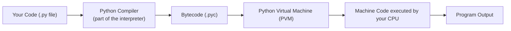
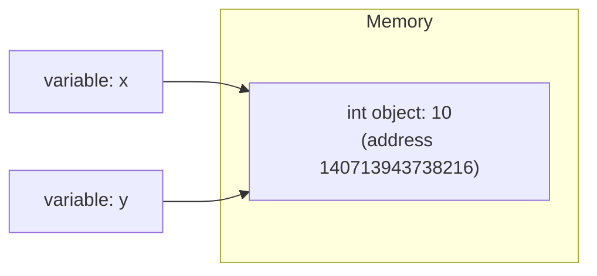
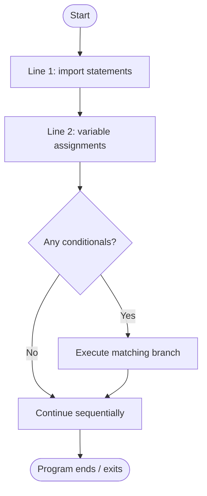

# 🐍 01 - Introduction to Python

> 🟢 Difficulty: Beginner | ⏱️ Estimated time: 45–60 minutes

---

## 📌 What is it?

**Python** is a high-level, general-purpose, interpreted programming language. "High-level" means it reads almost like English and hides the messy details of the computer's hardware from you. "Interpreted" means your code is run line-by-line by a program called an **interpreter**, rather than being compiled directly into a standalone executable ahead of time (we'll unpack exactly what this means below).

Python was created by **Guido van Rossum** and first released in **1991**. It's named after the British comedy show *Monty Python's Flying Circus* — not the snake — though the snake became the unofficial mascot anyway.

Today Python is used for:
- Web development (Django, Flask, FastAPI)
- Data science & machine learning (pandas, NumPy, PyTorch, TensorFlow)
- Automation & scripting
- Software testing
- Desktop applications
- Scientific computing
- Cybersecurity tooling

---

## 🤔 Why do we need it?

Every programming language exists to solve a problem. Python's problem was: **"Writing software is too hard and too slow."**

Before languages like Python, programmers using C or C++ had to:
- Manually manage memory (allocate and free it themselves)
- Write many lines of code just to print `"Hello"` or read a file
- Worry about low-level details like pointers and data types on every line

Python's designers asked: *what if code could be almost as readable as plain English, while still being powerful enough to build real software?*

That's why Python prioritizes:
1. **Readability** — code is meant to be read by humans first, computers second.
2. **Simplicity** — one obvious way to do a thing (see *The Zen of Python* below).
3. **Batteries included** — a huge standard library ships with Python so you rarely need external tools for common tasks.

---

## 🌍 Real-Life Analogy

Think of programming languages like modes of transportation:

| Language | Analogy | Why |
|---|---|---|
| Assembly / Machine Code | Walking, building your own road | Full control, extremely slow to get anywhere |
| C / C++ | Driving a manual transmission car | Fast and powerful, but you manage every gear shift (memory) yourself |
| **Python** | **Taking a self-driving car** | You tell it *where* you want to go (what result you want) and it handles most of the mechanical details for you |
| Java | Driving an automatic car with strict traffic rules | Structured, safe, a bit more ceremony |

Python trades a small amount of raw speed for a *huge* amount of developer speed — how fast **you** can turn an idea into working software.

---

## 🧾 Syntax — A First Look

You don't need to understand every symbol yet — this is just to see what Python code *looks like* before we go deeper in later chapters.

```python
# This is a comment — Python ignores this line when running the code
name = "Ada"          # a variable holding text
age = 28               # a variable holding a whole number

if age >= 18:
    print(f"{name} is an adult.")
else:
    print(f"{name} is a minor.")
```

**Output:**
```
Ada is an adult.
```

Notice:
- No semicolons `;` at the end of lines (unlike C, Java, JavaScript).
- No curly braces `{ }` to mark blocks of code — Python uses **indentation** (spacing) instead.
- `#` starts a comment.

We will explain every one of these symbols and rules in **Chapter 04 - Basic Syntax**. For now, just notice how close it reads to plain English.

---

## ⚙️ How It Works Internally

This is the part most beginner courses skip — but understanding it will make *every future chapter* make more sense.

### 1. Python is Interpreted (mostly)

When you run a Python file, here's what actually happens:



1. You write human-readable code in a `.py` file.
2. The **CPython interpreter** (the default, most common implementation of Python) first compiles your code into an intermediate form called **bytecode** — a low-level set of instructions, but not yet actual machine code your CPU understands directly.
3. This bytecode is handed to the **Python Virtual Machine (PVM)**, a program that reads bytecode instructions one at a time and executes them.
4. The PVM talks to your actual CPU and operating system to perform the real work (math, printing, file access, etc.).

> 💡 **Why does this matter?** Because it's *why* Python is generally slower than C, but *faster to write in*. There's an extra translation layer (bytecode + PVM) compared to a compiled language that goes straight to machine code.

### 2. CPython vs Other Implementations

"Python" is a language *specification* — a set of rules. There are multiple **implementations** (programs) that actually run Python code:

| Implementation | Written in | Notes |
|---|---|---|
| **CPython** | C | The default, official, most widely used implementation |
| PyPy | Python (RPython) | Uses Just-In-Time (JIT) compilation, often much faster |
| Jython | Java | Runs on the Java Virtual Machine |
| IronPython | C# | Runs on .NET |

Unless you go out of your way to install something else, when you type `python3` in your terminal, you are using **CPython**. Every mention of "how Python works internally" in this course refers to CPython.

---

## 🧠 Memory Representation

Even in an introduction chapter, it helps to preview one core idea: **in Python, everything is an object** — including numbers, text, and even functions.

```python
x = 10
y = 10
print(id(x))   # prints a memory address (as an integer)
print(id(y))
```

**Output (address will differ on your machine):**
```
140713943738216
140713943738216
```

Notice `x` and `y` point to the **same memory address**. Small integers in CPython are *cached* and reused — you're not creating two separate `10`s in memory, you're creating two names (`x` and `y`) that both point to the *same* `10` object.



> We'll go much deeper into this in **Chapter 05 - Variables** and **Chapter 21 - Memory Management**. For now, just remember: *a variable in Python is a label pointing to an object, not a box that holds a value directly.* This is different from languages like C.

---

## 🔄 Flow of Execution

When you run `python3 my_script.py`, Python executes the file **top to bottom, one statement at a time**, with these exceptions:
- Function and class definitions are *stored* but not *run* until called.
- Control structures (`if`, `for`, `while`) can skip or repeat sections.



---

## 💻 Examples

### 🟢 Simple Example
```python
print("Hello, World!")
```
**Output:**
```
Hello, World!
```
*Line-by-line:* `print()` is a built-in function that displays text on the screen. `"Hello, World!"` is a **string** (text data) passed as an argument to `print`.

---

### 🟡 Intermediate Example
```python
def greet(name):
    return f"Hello, {name}! Welcome to Python."

users = ["Ada", "Grace", "Alan"]
for user in users:
    print(greet(user))
```
**Output:**
```
Hello, Ada! Welcome to Python.
Hello, Grace! Welcome to Python.
Hello, Alan! Welcome to Python.
```
*Line-by-line:*
- `def greet(name):` defines a reusable function named `greet` that accepts one input, `name`.
- `f"Hello, {name}!..."` is an **f-string** — it inserts the value of `name` directly into the text.
- `for user in users:` loops over each item in the list `users`, one at a time.
- Each loop iteration calls `greet(user)` and prints the result.

---

### 🔴 Advanced Example
```python
from dataclasses import dataclass

@dataclass
class User:
    name: str
    age: int

    def is_adult(self) -> bool:
        return self.age >= 18

users = [User("Ada", 28), User("Sam", 15)]
adults = [u.name for u in users if u.is_adult()]
print(adults)
```
**Output:**
```
['Ada']
```
*Line-by-line:*
- `@dataclass` is a **decorator** that auto-generates boilerplate code (like `__init__`) for a class.
- `User` is a custom data type (class) with two fields: `name` and `age`.
- `is_adult` is a **method** — a function that belongs to the class.
- `[u.name for u in users if u.is_adult()]` is a **list comprehension** — a compact way to build a new list by filtering and transforming an existing one.

*(Don't worry if decorators, classes, and comprehensions look unfamiliar — they are fully covered in Chapters 11, 15, and 16. This is just a preview of where the language goes.)*

---

### 🌐 Real-World Example
A tiny script that reads a list of temperatures and reports which days were "hot" — a simplified version of a real weather-data processing task:

```python
temperatures_celsius = [22, 31, 28, 35, 19, 40, 25]

hot_days = [t for t in temperatures_celsius if t >= 30]

print(f"Number of hot days: {len(hot_days)}")
print(f"Hot day temperatures: {hot_days}")
```
**Output:**
```
Number of hot days: 3
Hot day temperatures: [31, 35, 40]
```

---

## ⚠️ Common Errors (Beginners)

| Mistake | Example | Why it fails | Fix |
|---|---|---|---|
| Mixing tabs and spaces | Indenting one line with a tab, another with spaces | Python enforces consistent indentation to define blocks | Use 4 spaces consistently (configure your editor) |
| Forgetting the colon `:` | `if age > 18` | Python requires `:` to start a new indented block | `if age > 18:` |
| Confusing `print` with `return` | Expecting a function to "return" just because it prints | `print()` only displays text; it doesn't send a value back to the caller | Use `return` when you need the value elsewhere |
| Case sensitivity | Using `Print("hi")` | Python is case-sensitive; `Print` ≠ `print` | Always use lowercase `print` |
| Running the wrong Python version | Typing `python` and getting Python 2 behavior on old systems | Some systems still alias `python` to Python 2 | Use `python3` explicitly (covered in Chapter 02) |

---

## ✅ Best Practices

1. **Follow PEP 8** — Python's official style guide (naming, spacing, layout). We'll reference PEP 8 throughout the course.
2. **Write readable code first, optimize later.** Python's philosophy (see the Zen of Python below) favors clarity.
3. **Use virtual environments** for every project (covered in Chapter 02) to avoid dependency conflicts.
4. **Read error messages fully** — Python's tracebacks tell you exactly which line failed and why.
5. **Type `import this` in a Python shell** to read *The Zen of Python* — 19 guiding principles behind the language's design, written by Tim Peters.

---

## 🚫 When NOT to Reach for Python

Being honest about trade-offs is part of being a good engineer:

- **Extremely performance-critical systems** (game engines, real-time embedded systems) — C, C++, or Rust are usually better choices.
- **Mobile app development** — Swift/Kotlin (or cross-platform frameworks) are more standard than Python.
- **Strict compile-time type safety requirements** — languages like Rust or TypeScript catch more errors before the program even runs.

Python shines when **developer speed, readability, and a rich ecosystem** matter more than raw execution speed.

---

## 📊 Performance Notes

- CPython uses a **Global Interpreter Lock (GIL)**, which means only one thread executes Python bytecode at a time, even on multi-core machines (explored fully in Chapter 27 - Multithreading).
- Python is generally slower than compiled languages for CPU-heavy tasks, but this is often irrelevant because:
  - Many "hot path" libraries (NumPy, pandas) are written in C/Fortran under the hood.
  - Developer time saved often outweighs raw execution speed for most applications.

---

## 🎤 Interview Questions

1. **Q: Is Python compiled or interpreted?**
   **A:** Both, in a sense. CPython first compiles source code to bytecode, then an interpreter (the PVM) executes that bytecode. It's not compiled all the way to native machine code ahead of time like C is.

2. **Q: What is CPython?**
   **A:** The reference, default implementation of Python, written in C. When people say "Python," they usually mean CPython.

3. **Q: Why is Python considered a "high-level" language?**
   **A:** Because it abstracts away hardware-level details (memory addresses, registers) and lets you write code closer to human language and problem-solving logic.

4. **Q: Name three domains where Python is heavily used.**
   **A:** Web development, data science/machine learning, and automation/scripting (also acceptable: scientific computing, cybersecurity, testing).

5. **Q: What is bytecode?**
   **A:** An intermediate, lower-level representation of your source code that the Python Virtual Machine executes. It's not human-readable source code, and it's not raw machine code either — it sits in between.

---

## 📝 Summary

- Python is a high-level, interpreted, general-purpose language created by Guido van Rossum in 1991.
- It prioritizes readability and developer productivity over raw execution speed.
- CPython compiles your code to bytecode, which the Python Virtual Machine then executes.
- Everything in Python is an object, including numbers and text.
- Python trades some performance for massive gains in how fast you can write and maintain software.
- It's not the right tool for every job (e.g., real-time systems), but it excels at web dev, data science, scripting, and general-purpose programming.

---

## ⏭️ Next Chapter

Continue to **[02 - Installation](../02-Installation/README.md)** to get Python running on your machine. *(Coming next — this course is built one chapter at a time.)*

---

📎 Continue to: [`notes.md`](./notes.md) · [`exercises.md`](./exercises.md) · [`solutions.md`](./solutions.md) · [`quiz.md`](./quiz.md) · [`project.md`](./project.md)
