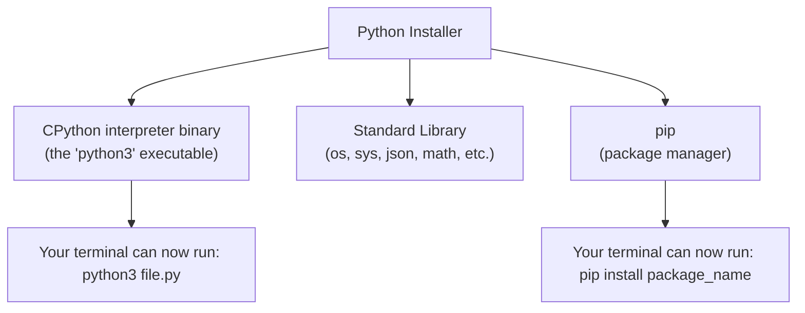
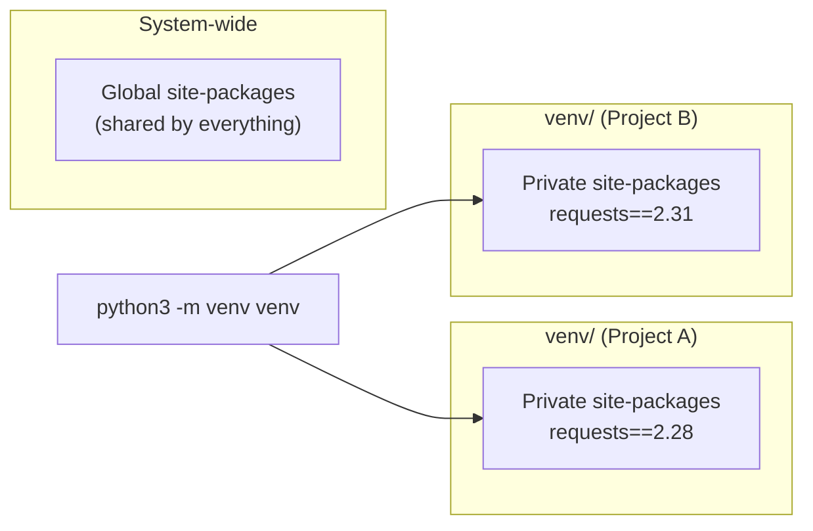

# ⚙️ 02 - Installation

> 🟢 Difficulty: Beginner | ⏱️ Estimated time: 30–45 minutes

---

## 📌 What is it?

"Installation" means getting the **Python interpreter** (the program that reads and runs your `.py` files — see Chapter 01) onto your computer, along with two companion tools you'll use constantly:

- **pip** — Python's package installer, used to download and install third-party libraries.
- **venv** — Python's built-in tool for creating **virtual environments**, isolated Python setups per project.

By the end of this chapter you'll have Python 3 running, know how to check its version, and understand *why* virtual environments matter before you write a single line of real project code.

---

## 🤔 Why do we need it?

Your computer doesn't understand Python by default — no more than it understands French or Japanese without a translator. You need to install the **interpreter** so your machine has a program capable of reading `.py` files and executing them (recall from Chapter 01: source code → bytecode → PVM → machine code — the interpreter is what makes that pipeline exist on your machine at all).

You also need `pip` and virtual environments because:
- Almost no real project uses *only* what ships with Python — you'll install external libraries.
- Different projects often need **different versions** of the same library. Without isolation, installing library version 2.0 for Project A could silently break Project B, which needed version 1.0.

---

## 🌍 Real-Life Analogy

Think of your computer as an apartment building:

- **Installing Python** is like installing electricity and plumbing in the building — the basic infrastructure every unit needs.
- **A virtual environment** is like giving each apartment (project) its own separate utility meter and storage closet. What Apartment 3B stores in its closet (its installed library versions) has zero effect on what's in Apartment 5A's closet.
- Without virtual environments, it's as if every apartment shared **one** communal closet — and if one tenant rearranges it for their needs, everyone else's stuff gets knocked over.

---

## 🧾 Syntax — Commands You'll Use

These aren't Python code — they're **terminal/command-line commands** you type in your operating system's shell (Terminal on macOS/Linux, PowerShell or Command Prompt on Windows).

```bash
# Check if Python is installed and see its version
python3 --version

# Check if pip is installed
pip3 --version

# Create a virtual environment named "venv" in the current folder
python3 -m venv venv

# Activate the virtual environment (macOS/Linux)
source venv/bin/activate

# Activate the virtual environment (Windows PowerShell)
venv\Scripts\Activate.ps1

# Install a package inside the active virtual environment
pip install requests

# Deactivate the virtual environment
deactivate
```

---

## ⚙️ How It Works Internally

### 1. What "installing Python" actually places on your machine



When you install Python, you're placing an executable program (`python3` or `python.exe`) on disk, along with the standard library modules and `pip`. Your operating system's **PATH** (a list of folders it searches for programs) is updated so that typing `python3` in any terminal finds and runs that executable.

### 2. What a virtual environment actually is

A virtual environment is **not magic** — it's just a folder containing:
- A private copy of (or link to) the Python interpreter.
- A private `site-packages` folder where `pip install`-ed libraries go.
- Activation scripts that temporarily modify your terminal's PATH to point at this private copy instead of your system-wide Python.



When you `activate` a virtual environment, your shell's `python` and `pip` commands are temporarily redirected to that project's private copies instead of the system-wide ones. `deactivate` restores normal behavior.

---

## 💻 Examples

### 🟢 Simple Example — Checking your installation
```bash
python3 --version
```
**Output (version may vary):**
```
Python 3.12.4
```

---

### 🟡 Intermediate Example — Creating and using a virtual environment
```bash
mkdir my_project
cd my_project
python3 -m venv venv
source venv/bin/activate
pip install requests
python3 -c "import requests; print(requests.__version__)"
```
**Output:**
```
2.31.0
```
*Line-by-line:* We create a project folder, create an isolated virtual environment inside it, activate that environment (so `pip` and `python3` now point at the private copies), install the `requests` library only into this environment, then confirm it's importable and check its version.

---

### 🔴 Advanced Example — Freezing and restoring exact dependencies
```bash
# Inside an activated venv, after installing packages:
pip freeze > requirements.txt

# On another machine (or after deleting venv), recreate the exact same environment:
python3 -m venv venv
source venv/bin/activate
pip install -r requirements.txt
```
**Output of `pip freeze`:**
```
requests==2.31.0
urllib3==2.2.1
certifi==2024.2.2
```
*Explanation:* `pip freeze` lists every installed package **and its exact version** in the active environment. Saving this to `requirements.txt` lets any teammate (or your future self, or a deployment server) recreate an identical environment — this is how real-world Python teams avoid "it works on my machine" bugs.

---

### 🌐 Real-World Example
A company's data science team shares a `requirements.txt` file in their Git repository so every team member's virtual environment has the **exact** same library versions — preventing subtle bugs caused by, say, one teammate having `pandas==1.5` while another has `pandas==2.0` with different behavior.

---

## ⚠️ Common Errors (Beginners)

| Mistake | Symptom | Fix |
|---|---|---|
| Typing `python` instead of `python3` | On some systems, `python` doesn't exist or points to old Python 2 | Always use `python3` (and `pip3`) until you configure aliases |
| Forgetting to activate the venv | Packages installed with `pip` don't show up when running your script | Run `source venv/bin/activate` (or the Windows equivalent) before installing/running |
| Installing packages globally instead of in a venv | Version conflicts between unrelated projects | Always create a venv per project |
| Committing the `venv/` folder to Git | Bloated repository, OS-specific binaries break for other contributors | Add `venv/` to `.gitignore`; share `requirements.txt` instead |
| PowerShell execution policy blocking activation (Windows) | Error when running `Activate.ps1` | Run PowerShell as Administrator and execute `Set-ExecutionPolicy RemoteSigned` (or consult your OS's docs) |

---

## ✅ Best Practices

1. **One virtual environment per project.** Never share one venv across unrelated projects.
2. **Always add `venv/` (or your chosen folder name) to `.gitignore`.**
3. **Keep a `requirements.txt`** (or modern equivalent like `pyproject.toml`) up to date so your project is reproducible.
4. **Use an IDE with virtual environment awareness** (VS Code, PyCharm) — they detect and let you select the active venv automatically.
5. **Prefer `python3 -m pip install ...`** over bare `pip install ...` when you want to be 100% sure which Python's pip you're using.

---

## 🚫 When NOT to Bother with a Virtual Environment

- For a **single, throwaway one-off script** with no external dependencies, a venv is unnecessary overhead.
- Even then, many experienced developers still use one out of habit — it costs almost nothing and prevents future headaches.

---

## 📊 Performance Notes

- Creating a virtual environment is a one-time disk-space and setup cost (typically a few seconds and tens of megabytes) — it has no runtime performance impact on your code.
- `pip install` speed depends on network speed and package size, not on whether you're using a venv.

---

## 🎤 Interview Questions

1. **Q: What problem do virtual environments solve?**
   **A:** They isolate per-project dependencies so different projects can use different (even conflicting) versions of the same library without interfering with each other.

2. **Q: What is `pip`?**
   **A:** Python's standard package manager, used to install, upgrade, and remove third-party libraries from the Python Package Index (PyPI) or other sources.

3. **Q: What does `pip freeze` do, and why is it useful?**
   **A:** It lists every installed package in the current environment along with its exact version, typically redirected into a `requirements.txt` file so the environment can be exactly reproduced elsewhere.

4. **Q: What actually happens when you "activate" a virtual environment?**
   **A:** Your shell's PATH is temporarily modified so that `python` and `pip` commands resolve to the venv's private copies instead of the system-wide installation.

5. **Q: Why shouldn't you commit a `venv/` folder to version control?**
   **A:** It's large, often contains OS-specific binaries that won't work on a different machine, and is fully reproducible from `requirements.txt` — committing it just bloats the repository for no benefit.

---

## 📝 Summary

- Installing Python puts the interpreter, standard library, and `pip` on your machine.
- `pip` installs third-party packages; virtual environments isolate those packages per project.
- A virtual environment is just a folder with a private interpreter reference and private `site-packages`, plus scripts that redirect your shell's PATH when activated.
- `pip freeze > requirements.txt` and `pip install -r requirements.txt` are the standard way to make environments reproducible across machines and teammates.
- Best practice: one venv per project, never commit it to Git, always keep a requirements file.

---

## ⏭️ Next Chapter

Continue to **[03 - Hello World](../03-Hello-World/README.md)**. *(Coming next.)*

---

📎 Continue to: [`notes.md`](./notes.md) · [`exercises.md`](./exercises.md) · [`solutions.md`](./solutions.md) · [`quiz.md`](./quiz.md) · [`project.md`](./project.md)
