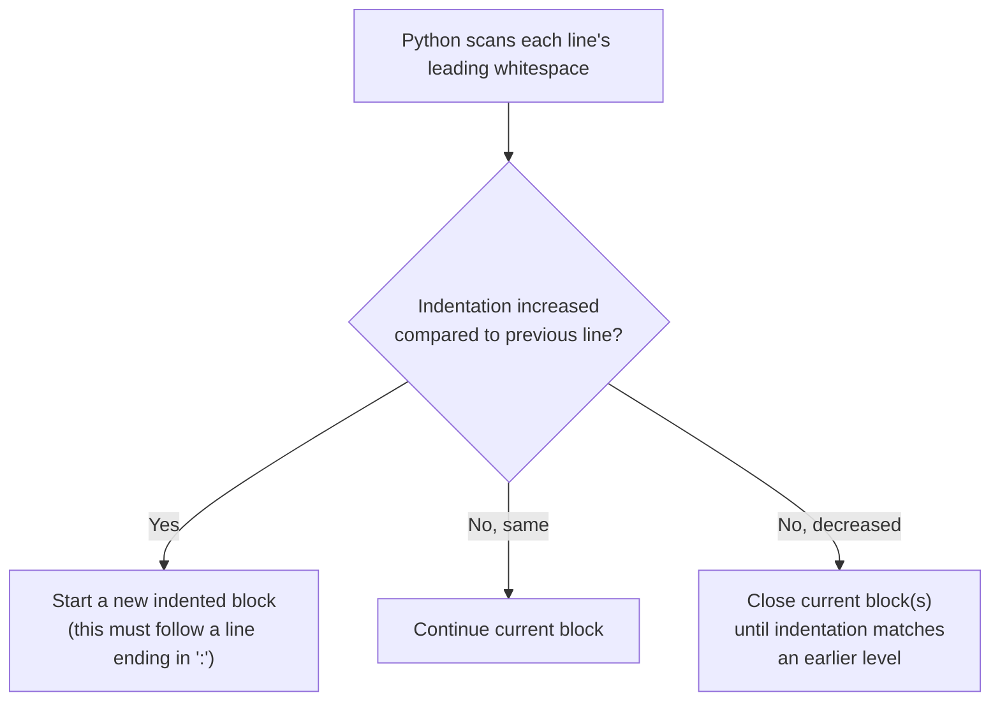
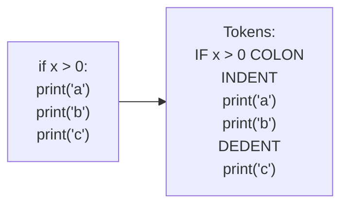

# 📐 04 - Basic Syntax

> 🟢 Difficulty: Beginner | ⏱️ Estimated time: 50–65 minutes

---

## 📌 What is it?

**Syntax** is the set of rules that define what a "correctly formed" piece of code looks like in a language — similar to grammar rules in English. Python's syntax is famous for being unusually clean because it uses **indentation** (whitespace) to define structure, instead of the curly braces `{ }` or `BEGIN`/`END` keywords used by many other languages.

This chapter covers the foundational rules you'll use in literally every Python file you ever write: statements, indentation, comments, identifiers, keywords, line continuation, and whitespace conventions.

---

## 🤔 Why do we need it?

Every language needs unambiguous rules so the interpreter knows exactly where one instruction ends and the next begins, and which lines belong together as a group (like the body of an `if` statement). Without agreed-upon syntax rules:
- The interpreter couldn't reliably parse your intent.
- Different programmers' code would be inconsistent and hard to read.

Python's specific choice — **indentation instead of braces** — was a deliberate design decision to *force* consistently readable code, since messy indentation is immediately visually obvious (and, more importantly, actually breaks the program) rather than being just a style preference.

---

## 🌍 Real-Life Analogy

Think of indentation like paragraph structure in a recipe:

```
Bake the cake:
    Preheat the oven.
    Mix the batter.
    Pour into a pan.
Serve the cake:
    Add frosting.
    Cut into slices.
```

The indentation visually groups "Preheat the oven" and "Mix the batter" as sub-steps of "Bake the cake." If you shifted "Cut into slices" leftward to align with "Bake the cake," it would confusingly imply it's a top-level step, not part of serving. Python enforces this same visual grouping as an actual **rule**, not just a suggestion.

---

## 🧾 Syntax — Core Rules

### 1. Statements
A **statement** is a single instruction. Usually one statement per line:
```python
x = 5
print(x)
```

### 2. Indentation defines blocks
```python
if x > 0:
    print("Positive")
    print("Still inside the if-block")
print("Outside the if-block")
```
**Output (when x = 5):**
```
Positive
Still inside the if-block
Outside the if-block
```

### 3. Comments
```python
# This is a single-line comment
x = 5  # This is an inline comment
```

### 4. Identifiers (names)
Rules for naming variables, functions, classes, etc.:
- Can contain letters, numbers, and underscores (`_`)
- Cannot start with a number
- Cannot be a reserved **keyword** (like `if`, `for`, `class`)
- Case-sensitive (`age` ≠ `Age`)

```python
user_name = "Ada"     # valid
_private = 42          # valid
age2 = 30              # valid
2fast = "no"           # INVALID — starts with a number
```

### 5. Keywords (reserved words)
Words Python reserves for its own grammar — you cannot use them as variable names:
```
False   None    True    and     as      assert  async   await
break   class   continue def     del     elif    else    except
finally for     from    global   if      import  in      is
lambda  nonlocal not     or      pass    raise   return   try
while   with    yield
```

### 6. Line continuation
```python
total = 1 + 2 + 3 + \
        4 + 5
```
Or, more commonly, using parentheses (preferred style):
```python
total = (1 + 2 + 3 +
         4 + 5)
```

---

## ⚙️ How It Works Internally

### 1. How Python decides where a block starts and ends



Internally, CPython's **tokenizer** (the part of the compiler that breaks source code into meaningful chunks called tokens) generates special `INDENT` and `DEDENT` tokens whenever indentation increases or decreases. These tokens function like invisible "start block" / "end block" markers — conceptually similar to `{` and `}` in other languages, except Python derives them automatically from your whitespace instead of requiring you to type them.



### 2. Why mixing tabs and spaces breaks things

Python needs indentation to be **consistent** in order to reliably generate those `INDENT`/`DEDENT` tokens. If one line uses a tab character and a sibling line uses spaces, Python (in Python 3) will raise a `TabError`, because it cannot be sure whether the two lines are meant to be at the same indentation depth.

---

## 💻 Examples

### 🟢 Simple Example
```python
# A single statement per line, with a comment
name = "Ada"  # store a name
print(name)
```
**Output:**
```
Ada
```

---

### 🟡 Intermediate Example — Nested blocks
```python
age = 20
has_id = True

if age >= 18:
    print("You are an adult.")
    if has_id:
        print("You may enter.")
    else:
        print("ID required.")
else:
    print("You are a minor.")
```
**Output:**
```
You are an adult.
You may enter.
```
*Line-by-line:* The outer `if` block is indented once (4 spaces). The nested `if/else` inside it is indented twice (8 spaces). Python uses these two distinct indentation depths to know which lines belong to which block.

---

### 🔴 Advanced Example — Line continuation and multi-statement style pitfalls
```python
# Implicit continuation via parentheses (preferred)
numbers = [
    1, 2, 3,
    4, 5, 6,
]
total = sum(numbers)

# Explicit continuation via backslash (works, but less preferred)
message = "This is a long string that " + \
          "spans multiple lines using a backslash."

print(total)
print(message)

# Multiple statements on one line using a semicolon (legal, but discouraged)
a = 1; b = 2; print(a + b)
```
**Output:**
```
21
This is a long string that spans multiple lines using a backslash.
3
```
*Explanation:* Python allows several ways to spread code across multiple lines or squeeze multiple statements onto one line, but PEP 8 (the official style guide) recommends parentheses-based continuation over backslashes, and one statement per line over semicolon-separated statements, because both improve readability.

---

### 🌐 Real-World Example
Real Python codebases (like Django or Flask's source) almost always format long function calls or data structures using parentheses/brackets across multiple lines — exactly like the `numbers = [...]` example above — rather than backslash continuation, because it's more resilient to accidental trailing-whitespace bugs and easier to read in code review tools.

---

## ⚠️ Common Errors (Beginners)

| Mistake | Example | Why it fails | Fix |
|---|---|---|---|
| Missing colon | `if x > 0` (no `:`) | Python requires `:` to start an indented block | `if x > 0:` |
| Inconsistent indentation | Mixing 2-space and 4-space indents in siblings | Python can't determine if lines belong to the same block | Pick one consistent indentation width (4 spaces is the PEP 8 standard) and stick to it |
| Mixing tabs and spaces | Some lines use `\t`, others use spaces | Python 3 raises a `TabError` since it can't safely resolve the ambiguity | Configure your editor to insert spaces when you press Tab |
| Using a keyword as a variable name | `class = "Math"` | `class` is reserved for defining classes | Rename to `class_name` or similar |
| Starting an identifier with a digit | `2fast = True` | Identifiers cannot start with a number | `fast2 = True` |

---

## ✅ Best Practices

1. **Use 4 spaces per indentation level** (PEP 8 standard) — never tabs.
2. **Configure your editor** to convert Tab key presses into spaces automatically.
3. **Prefer parentheses/brackets for line continuation** over backslashes.
4. **One statement per line** — avoid semicolon-separated statements even though they're legal.
5. **Use descriptive identifier names** (`user_age`, not `x` or `a`) once you move beyond quick experiments.
6. **Add comments to explain *why*, not *what*** — code already shows *what* it does; comments are most valuable explaining reasoning that isn't obvious from the code itself.

---

## 🚫 When NOT to Over-Comment

- Don't restate the obvious: `x = 5  # set x to 5` adds no value.
- Excessive comments on trivial lines clutter code and can go stale (wrong) as code changes, misleading future readers.

---

## 📊 Performance Notes

- Comments and whitespace/indentation have **zero runtime performance cost** — they're discarded or interpreted purely at compile time (tokenization stage) and never appear in the resulting bytecode.
- Choosing 4 spaces vs. 2 spaces vs. tabs has no effect on execution speed — it's purely a style/readability decision (governed by PEP 8 convention).

---

## 🎤 Interview Questions

1. **Q: How does Python define blocks of code, and how does this differ from languages like C or Java?**
   **A:** Python uses **indentation (whitespace)** to define blocks, generating internal `INDENT`/`DEDENT` tokens during tokenization. C and Java use explicit curly braces `{ }` instead, making indentation in those languages a style choice rather than a syntactic requirement.

2. **Q: What happens if you mix tabs and spaces in your indentation in Python 3?**
   **A:** Python 3 raises a `TabError`, because it cannot reliably determine whether lines are meant to be at the same indentation depth.

3. **Q: What is a Python keyword, and can you use one as a variable name?**
   **A:** A keyword is a reserved word with special meaning in Python's grammar (like `if`, `for`, `class`). You cannot use keywords as variable, function, or class names.

4. **Q: What are the two main ways to continue a statement across multiple lines in Python?**
   **A:** Wrapping the expression in parentheses/brackets/braces (implicit continuation, preferred), or ending a line with a backslash `\` (explicit continuation, less preferred).

5. **Q: Why does PEP 8 recommend against putting multiple statements on one line with semicolons?**
   **A:** Because it reduces readability — one clear statement per line makes code easier to scan, debug, and review, even though semicolon-separated statements are technically legal Python.

---

## 📝 Summary

- Python uses **indentation**, not braces, to define code blocks — enforced by the language itself, not just a style convention.
- A colon `:` signals the start of an indented block (after `if`, `for`, `while`, `def`, `class`, etc.).
- **Identifiers** name variables/functions/classes; they can't start with a digit or be a reserved **keyword**.
- Comments start with `#` and are ignored entirely at runtime.
- Long statements can be continued across lines using parentheses (preferred) or backslashes (less preferred).
- Mixing tabs and spaces causes a `TabError` in Python 3 — always use spaces consistently (4 per level, per PEP 8).

---

## ⏭️ Next Chapter

Continue to **[05 - Variables](../05-Variables/README.md)**. *(Coming next.)*

---

📎 Continue to: [`notes.md`](./notes.md) · [`exercises.md`](./exercises.md) · [`solutions.md`](./solutions.md) · [`quiz.md`](./quiz.md) · [`project.md`](./project.md)
