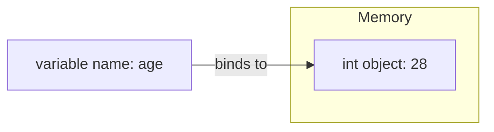
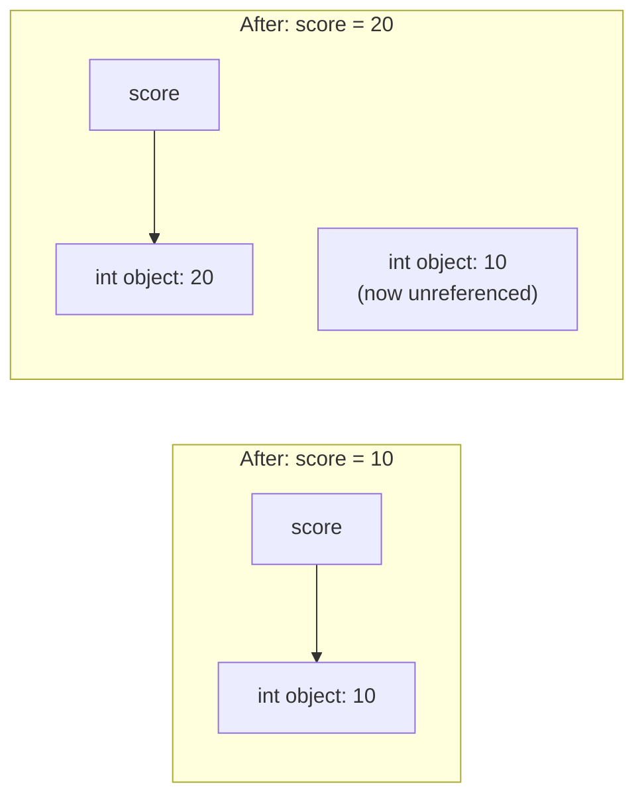

# 🏷️ 05 - Variables

> 🟢 Difficulty: Beginner | ⏱️ Estimated time: 55–70 minutes

---

## 📌 What is it?

A **variable** is a name you give to a piece of data so you can refer to it later without retyping the actual value. In Python:

```python
age = 28
```

Here, `age` is the variable name, and `28` is the value it currently refers to. But — as previewed in Chapter 01 — Python variables work a little differently under the hood than in many other languages, and understanding that difference now will save you from confusing bugs later.

---

## 🤔 Why do we need it?

Without variables, every program would be forced to work with literal, hard-coded values everywhere, making code:
- **Impossible to reuse** — you'd have to retype `28` in fifty places if you meant "the user's age."
- **Impossible to update safely** — changing one value would mean hunting down every occurrence of it.
- **Hard to read** — `28` tells you nothing; `age` tells you exactly what the value represents.

Variables let you **name your intent**, store results of computations, and build programs that manipulate changing data over time.

---

## 🌍 Real-Life Analogy

Think of a variable like a **sticky note with a label**, stuck onto a box in a warehouse. The label (`age`) doesn't *contain* the box's contents — it just points to *which* box to look in. If you move the sticky note to point at a different box, the label now refers to different contents, but the original box you moved it away from doesn't disappear — it just no longer has that particular label on it (unless something else is still pointing at it).

This is different from thinking of a variable as "a box that holds a value directly" (which is closer to how languages like C work) — in Python, **the variable is the label, not the box**.

---

## 🧾 Syntax

### Basic assignment
```python
name = "Ada"
age = 28
height = 1.75
is_student = False
```

### Multiple assignment (same value to several names)
```python
x = y = z = 0
```

### Multiple assignment (different values, one line)
```python
name, age, city = "Ada", 28, "London"
```

### Reassignment
```python
score = 10
score = 20   # score now refers to a different value
```

### Augmented assignment (shorthand update-and-reassign)
```python
score = 10
score += 5   # equivalent to: score = score + 5
```

### Swapping two variables (Python-specific convenience)
```python
a, b = 1, 2
a, b = b, a   # now a = 2, b = 1
```

### Naming convention for constants
```python
MAX_USERS = 100   # ALL_CAPS by convention signals "treat this as unchanging"
```

---

## ⚙️ How It Works Internally

### 1. Variables are names bound to objects, not boxes holding values



When you write `age = 28`, Python does three things:
1. Creates (or reuses, for small cached integers) an **object** representing `28` somewhere in memory.
2. Creates a **name**, `age`, in the current **namespace** (a lookup table mapping names to objects — we'll cover namespaces fully in Chapter 12 - Scope).
3. **Binds** the name `age` to that object.

This is called **name binding**, and it's fundamentally different from "storing a value in a box." The variable name is just a reference/pointer — a label — to wherever the actual object lives in memory.

### 2. What happens on reassignment

```python
score = 10
score = 20
```



`score = 20` doesn't modify the `10` object — it creates (or looks up) a **new** `20` object and re-binds the name `score` to point at it instead. The old `10` object still exists momentarily, but since nothing refers to it anymore, Python's **garbage collector** will eventually reclaim that memory (covered fully in Chapter 21 - Memory Management).

### 3. Dynamic typing

Python is **dynamically typed** — a variable name isn't locked to one data type forever. The *object* has a type; the *name* is just currently pointing at it.

```python
x = 5          # x currently points to an int
x = "hello"    # x now points to a str — completely legal
```

This is different from **statically typed** languages (like Java or C), where a variable's type is fixed at the point of declaration and can never change.

### 4. Multiple assignment and tuple unpacking, internally

```python
name, age, city = "Ada", 28, "London"
```

Internally, Python first builds a **tuple** `("Ada", 28, "London")` on the right-hand side, then **unpacks** it, binding each name on the left to the corresponding position in that tuple. This is why `a, b = b, a` works as a clean swap — the right-hand side tuple `(b, a)` is fully built *before* any reassignment happens on the left.

---

## 💻 Examples

### 🟢 Simple Example
```python
name = "Ada"
age = 28
print(name)
print(age)
```
**Output:**
```
Ada
28
```

---

### 🟡 Intermediate Example — Reassignment and dynamic typing
```python
value = 100
print(type(value), value)

value = "one hundred"
print(type(value), value)

value = [1, 2, 3]
print(type(value), value)
```
**Output:**
```
<class 'int'> 100
<class 'str'> one hundred
<class 'list'> [1, 2, 3]
```
*Line-by-line:* The same name `value` is re-bound three times to objects of three completely different types. Python allows this freely because types belong to objects, not to variable names.

---

### 🔴 Advanced Example — Identity vs. equality with variable rebinding
```python
a = [1, 2, 3]
b = a          # b now points to the SAME list object as a
b.append(4)

print(a)       # a shows the change too!
print(a is b)  # True — same object

c = [1, 2, 3, 4]
print(a == c)  # True — equal values
print(a is c)  # False — different objects
```
**Output:**
```
[1, 2, 3, 4]
True
True
False
```
*Explanation:* `b = a` doesn't copy the list — it makes `b` a second name pointing at the *exact same* list object as `a`. Modifying the list through `b` is visible through `a` too, because there's only ever been one list object involved. `c`, however, is a *separate* list object that happens to contain equal values — `==` compares values, `is` compares identity (memory address).

---

### 🌐 Real-World Example
A shopping cart system might do:
```python
cart = []
cart_reference = cart   # both names point to the same list
cart_reference.append("Laptop")
print(cart)  # ['Laptop'] — because cart and cart_reference are the same object
```
This exact behavior is why real-world bugs happen when developers assume assignment always "copies" — it doesn't, for mutable objects like lists (fully explored in Chapter 13 - Arrays and Chapter 21 - Memory Management).

---

## ⚠️ Common Errors (Beginners)

| Mistake | Example | Why it fails | Fix |
|---|---|---|---|
| Using a variable before assigning it | `print(score)` with no prior `score = ...` | `NameError: name 'score' is not defined` | Assign a value before referencing the name |
| Assuming `b = a` copies a list | `b = a; b.append(1)` then being surprised `a` changed too | Both names point to the same object | Use `b = a.copy()` (or `list(a)`) to make an actual independent copy |
| Confusing `=` (assignment) with `==` (equality) | `if score = 10:` | `=` is assignment, not comparison, and is invalid inside an `if` condition | Use `if score == 10:` |
| Forgetting Python allows type changes | Assuming reassigning `age = "twenty-eight"` will error because `age` was previously an int | Python is dynamically typed — this reassignment is completely legal | No fix needed, just adjust your mental model |
| Reusing a keyword as a variable name | `type = "Sedan"` shadows the built-in `type()` function | Now calling `type(x)` later fails because `type` refers to your string | Avoid naming variables after built-in function names |

---

## ✅ Best Practices

1. **Use descriptive, lowercase-with-underscores names** (`user_age`, not `ua` or `UserAge`) — this convention is called `snake_case`.
2. **Use `ALL_CAPS`** for values intended to act as constants (`MAX_RETRIES = 3`), even though Python doesn't technically enforce immutability on them.
3. **Avoid shadowing built-in names** like `list`, `type`, `str`, `id`, or `input` as variable names.
4. **Prefer explicit copies** (`.copy()`) when you need an independent duplicate of a mutable object, rather than plain assignment.
5. **Initialize variables close to where they're first used**, rather than declaring a huge block of variables at the top with no context.

---

## 🚫 When Reassignment Can Bite You

- Reassigning a variable to a wildly different type partway through a function can make code confusing to read and debug — even though it's legal, it's often a sign you should use two differently-named variables instead.
- Relying on `b = a` to "copy" a mutable object (list, dict, set) is a very common source of subtle bugs — always ask "do I want a shared reference, or an independent copy?"

---

## 📊 Performance Notes

- Variable assignment itself (name binding) is extremely fast — it's just updating an entry in a namespace dictionary.
- CPython caches small integers (-5 to 256) and interns some short strings, meaning multiple variables referencing these values may share the same underlying object — a memory optimization, not something your code should rely on for correctness (use `==`, not `is`, to compare values).

---

## 🎤 Interview Questions

1. **Q: Is a Python variable a container that holds a value, or a name bound to an object?**
   **A:** A name bound to an object. The object exists independently in memory; the variable is just a reference/label pointing to it.

2. **Q: What does it mean that Python is "dynamically typed"?**
   **A:** A variable name isn't locked to one data type — it can be reassigned to point at objects of any type over its lifetime, since the type belongs to the object, not the name.

3. **Q: What's the difference between `is` and `==`?**
   **A:** `==` compares whether two objects have equal *values*. `is` compares whether two names refer to the *exact same object* in memory (identity).

4. **Q: If `b = a` and `a` is a list, does modifying `b` affect `a`?**
   **A:** Yes — because `b` and `a` both point to the same underlying list object; there's no copy involved in a plain assignment.

5. **Q: What naming convention does Python commonly use for variables, and what convention is often used for constants?**
   **A:** `snake_case` (lowercase with underscores) for regular variables; `ALL_CAPS` for values intended to be treated as constants.

---

## 📝 Summary

- A variable is a **name bound to an object**, not a box holding a value directly.
- Assignment (`=`) creates or updates a binding between a name and an object; it doesn't necessarily create a new object or a copy.
- Python is **dynamically typed** — the same variable name can be reassigned to objects of different types.
- `b = a` for mutable objects (like lists) makes `b` and `a` refer to the *same* object — not a copy.
- `==` checks value equality; `is` checks object identity.
- Naming conventions: `snake_case` for variables, `ALL_CAPS` for constants.

---

## ⏭️ Next Chapter

Continue to **[06 - Data Types](../06-Data-Types/README.md)**. *(Coming next.)*

---

📎 Continue to: [`notes.md`](./notes.md) · [`exercises.md`](./exercises.md) · [`solutions.md`](./solutions.md) · [`quiz.md`](./quiz.md) · [`project.md`](./project.md)
