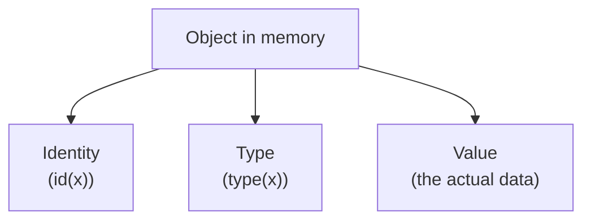
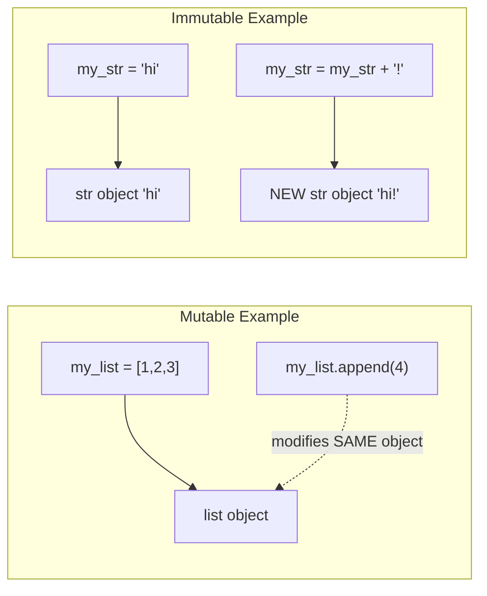

# 🔢 06 - Data Types

> 🟢 Difficulty: Beginner | ⏱️ Estimated time: 65–80 minutes

---

## 📌 What is it?

A **data type** describes what *kind* of value an object represents, and what operations make sense on it. Python has several built-in data types you'll use constantly:

| Category | Types |
|---|---|
| Numeric | `int`, `float`, `complex` |
| Text | `str` |
| Boolean | `bool` |
| Sequence | `list`, `tuple`, `range` |
| Mapping | `dict` |
| Set | `set`, `frozenset` |
| None | `NoneType` |

This chapter covers each type's purpose, behavior, and internal representation. Deeper dives into lists, strings, dictionaries, and sets each get their own full chapters later (13, 14, 15) — here we build the foundational map of "what exists and when to reach for it."

---

## 🤔 Why do we need it?

Different kinds of real-world data need different kinds of operations:
- You can multiply two numbers, but multiplying two pieces of text doesn't make the same kind of sense.
- You can look up a dictionary entry by key, but a list only makes sense to look up by position.

Types let Python (and you) know what operations are valid, catch nonsensical operations as errors, and represent data efficiently in memory.

---

## 🌍 Real-Life Analogy

Think of data types like containers in a kitchen:
- **`int`/`float`** are like a **measuring cup** — built for numeric operations (adding, scaling).
- **`str`** is like a **whiteboard with text** — built for reading, combining, and searching words.
- **`list`** is like a **shopping list** — an ordered, changeable sequence of items.
- **`tuple`** is like a **sealed recipe card** — an ordered sequence you're not meant to alter.
- **`dict`** is like a **labeled spice rack** — you look things up by name (key), not position.
- **`set`** is like a **bag of unique tokens** — no duplicates, no particular order.

You wouldn't try to pour flour from a whiteboard, and you wouldn't try to alphabetize a measuring cup — matching the right "container" (type) to the right job is exactly what choosing a data type is about.

---

## 🧾 Syntax — A Tour of Python's Built-in Types

```python
# Numeric types
whole_number = 42            # int
pi_estimate = 3.14159        # float
complex_number = 2 + 3j      # complex (rarely used outside scientific computing)

# Text type
greeting = "Hello"            # str

# Boolean type
is_active = True              # bool (True / False)

# Sequence types
numbers = [1, 2, 3]            # list — ordered, mutable
coordinates = (10, 20)         # tuple — ordered, immutable
countdown = range(5)           # range — a memory-efficient sequence of numbers

# Mapping type
person = {"name": "Ada", "age": 28}   # dict — key-value pairs

# Set types
unique_ids = {1, 2, 3}          # set — unordered, no duplicates
frozen_ids = frozenset({1, 2})  # frozenset — an immutable set

# None type
result = None                  # represents "no value" / "nothing here yet"
```

### Checking a value's type
```python
print(type(42))          # <class 'int'>
print(type(3.14))         # <class 'float'>
print(type("hi"))         # <class 'str'>
print(type(True))         # <class 'bool'>
print(type([1, 2]))       # <class 'list'>
print(type(None))         # <class 'NoneType'>
```

---

## ⚙️ How It Works Internally

### 1. Every value is an object with a type

Recall from Chapter 01: **everything in Python is an object.** Each object carries three things internally:
- An **identity** (its memory address — what `id()` returns)
- A **type** (what `type()` returns — this determines what operations are valid)
- A **value** (the actual data)



### 2. Mutable vs. Immutable Types

This is one of the most important internal distinctions in Python:

| Mutable (can change in place) | Immutable (cannot change in place) |
|---|---|
| `list` | `int`, `float`, `complex` |
| `dict` | `str` |
| `set` | `tuple` |
| | `bool` |
| | `frozenset` |



When you "modify" an immutable object (like appending to a string with `+`), Python doesn't change the original object — it creates a brand-new object and rebinds the name to it. Mutable objects, on the other hand, can genuinely be changed in place, with all other references to that same object seeing the update (as we saw with `b = a` in Chapter 05).

### 3. Why this distinction matters practically

- Immutable objects are **safe to share freely** — nobody can surprise you by changing them out from under you.
- Immutable objects can be used as **dictionary keys** or **set elements** (which require a stable, unchanging value to hash consistently) — mutable objects generally cannot.
- Mutable objects are more memory-efficient for large data you intend to update repeatedly (no need to recreate a whole new object every change).

---

## 💻 Examples

### 🟢 Simple Example
```python
age = 28
name = "Ada"
is_student = False

print(type(age))
print(type(name))
print(type(is_student))
```
**Output:**
```
<class 'int'>
<class 'str'>
<class 'bool'>
```

---

### 🟡 Intermediate Example — Type conversion (casting)
```python
age_text = "28"
age_number = int(age_text)      # str -> int
print(age_number + 2)

price = 19
price_as_float = float(price)   # int -> float
print(price_as_float)

count = 5
count_as_text = str(count)      # int -> str
print("You have " + count_as_text + " items")

flag = bool(0)                  # int -> bool
print(flag)
```
**Output:**
```
30
19.0
You have 5 items
False
```
*Line-by-line:* `int()`, `float()`, `str()`, and `bool()` are built-in functions that attempt to convert a value from one type to another — called **type casting**. Note `bool(0)` is `False`, while `bool()` of any non-zero number is `True` (covered fully with truthiness rules in Chapter 07 - Operators).

---

### 🔴 Advanced Example — Mutability in action
```python
# Immutable: strings
text = "hello"
original_id = id(text)
text = text + " world"
print(id(text) == original_id)   # False — a NEW object was created

# Mutable: lists
numbers = [1, 2, 3]
original_id = id(numbers)
numbers.append(4)
print(id(numbers) == original_id)  # True — SAME object, just modified

# Why this matters for dict keys
valid_key = (1, 2)          # tuple: immutable, hashable -> works as a dict key
cache = {valid_key: "cached result"}
print(cache)

try:
    invalid_key = [1, 2]     # list: mutable, unhashable -> fails as a dict key
    cache2 = {invalid_key: "won't work"}
except TypeError as e:
    print(f"Error: {e}")
```
**Output:**
```
False
True
{(1, 2): 'cached result'}
Error: unhashable type: 'list'
```
*Explanation:* Strings are immutable, so "modifying" one always produces a new object. Lists are mutable, so `.append()` changes the original object in place. Because dictionary keys must be hashable (stable, unchanging), only immutable types like tuples (containing only immutable elements) can serve as keys — lists cannot.

---

### 🌐 Real-World Example
A caching system for expensive computations often uses a tuple of input arguments as a dictionary key (`cache[(arg1, arg2)] = result`) precisely because tuples are immutable and hashable, while the equivalent list `[arg1, arg2]` would raise a `TypeError` if used the same way.

---

## ⚠️ Common Errors (Beginners)

| Mistake | Example | Why it fails | Fix |
|---|---|---|---|
| Adding incompatible types | `"5" + 5` | Python won't implicitly convert a string and an int for `+` | Convert explicitly: `int("5") + 5` or `"5" + str(5)` |
| Using a mutable object as a dict key | `{[1,2]: "value"}` | Lists aren't hashable | Use a tuple instead: `{(1,2): "value"}` |
| Assuming `bool("False")` is `False` | `bool("False")` | Any non-empty string is truthy, regardless of its *content* | Compare the string directly: `text == "False"` |
| Forgetting `int()` truncates, doesn't round | `int(9.9)` expecting `10` | `int()` truncates toward zero, it doesn't round | Use `round(9.9)` if you want rounding |
| Confusing `None` with `0`, `False`, or `""` | `if value == None` mismatches unexpectedly | `None` is a distinct object representing "no value," not falsy-zero | Use `if value is None:` for the idiomatic, correct check |

---

## ✅ Best Practices

1. **Use `is None` / `is not None`**, not `== None`, to check for `None` — this is the idiomatic and technically correct approach (checking identity against the single, unique `None` object).
2. **Choose tuples over lists** when data shouldn't change (e.g., fixed coordinates, RGB values).
3. **Convert types explicitly** rather than relying on Python to guess — clarity beats implicit magic.
4. **Use `type()` sparingly in real logic** — prefer duck typing or `isinstance()` (introduced properly in Chapter 16 - OOP) for flexible type checks.
5. **Remember: `int()` truncates, `round()` rounds** — don't mix these up.

---

## 🚫 When NOT to Use Certain Types

- Avoid `list` for data you don't want accidentally mutated elsewhere in your program — prefer `tuple`.
- Avoid `dict` when insertion order/uniqueness-by-key isn't actually meaningful for your data — a plain `list` may be simpler.
- Avoid `complex` numbers unless you're doing scientific/engineering computation that genuinely needs them.

---

## 📊 Performance Notes

- Checking `x is None` is faster than `x == None` because identity comparison is a simple pointer check, while equality comparison could, in principle, call a custom `__eq__` method.
- Tuples are generally slightly more memory-efficient and faster to create than lists of the same size, because Python can make certain optimizations knowing they'll never change.
- Type conversions (`int()`, `str()`, etc.) do real work and aren't free — avoid unnecessary repeated conversions inside tight loops (previewed here, covered fully in Chapter 33 - Performance Optimization).

---

## 🎤 Interview Questions

1. **Q: What's the difference between mutable and immutable types? Give one example of each.**
   **A:** Mutable types can be changed in place after creation (e.g., `list`); immutable types cannot — any "modification" actually creates a new object (e.g., `str`, `tuple`, `int`).

2. **Q: Why can't a list be used as a dictionary key?**
   **A:** Dictionary keys must be hashable, meaning their hash value must never change over their lifetime. Lists are mutable, so their contents (and thus their hash) could change, which would break the dictionary's internal lookup structure — so Python disallows it entirely.

3. **Q: What's the correct way to check if a variable is `None`?**
   **A:** `if value is None:` — using `is` because `None` is a single, unique singleton object, so identity comparison is both correct and idiomatic.

4. **Q: What does `int(9.9)` return, and why might a beginner expect something different?**
   **A:** It returns `9`, because `int()` truncates toward zero rather than rounding — a beginner might expect `10` if they're thinking of "rounding" rather than "truncating."

5. **Q: Name Python's four main built-in collection types and one key property of each.**
   **A:** `list` (ordered, mutable), `tuple` (ordered, immutable), `dict` (key-value mapping), `set` (unordered, unique elements).

---

## 📝 Summary

- Python's core built-in types include `int`, `float`, `complex`, `str`, `bool`, `list`, `tuple`, `dict`, `set`, `frozenset`, and `NoneType`.
- Every object has an identity, a type, and a value.
- Types are split into **mutable** (can change in place: list, dict, set) and **immutable** (cannot: int, float, str, tuple, bool, frozenset).
- Only immutable, hashable types can be used as dictionary keys or set elements.
- Type conversion functions (`int()`, `float()`, `str()`, `bool()`) let you explicitly cast between types.
- Use `is None`, not `== None`, to check for the absence of a value.

---

## ⏭️ Next Chapter

Continue to **[07 - Operators](../07-Operators/README.md)**. *(Coming next.)*

---

📎 Continue to: [`notes.md`](./notes.md) · [`exercises.md`](./exercises.md) · [`solutions.md`](./solutions.md) · [`quiz.md`](./quiz.md) · [`project.md`](./project.md)
