<div align="center">

<!-- LOGO PLACEHOLDER: replace with /assets/logo.png -->


# 🐍 Learn-Python

### The Most Complete, Free, Open-Source Python Course on GitHub

**From absolute zero to professional, interview-ready Python developer — no YouTube required.**

[](./LICENSE)
[](./CONTRIBUTING.md)
[]()
[]()

</div>

---

## 📖 Description

**Learn-Python** is a self-contained, GitHub-native curriculum that teaches the Python programming language from the very first principles ("what is a variable?") all the way to advanced, production-grade topics (concurrency, design patterns, databases, security, and system design interviews).

Every chapter is written so that a complete beginner can follow it with zero prior knowledge, while still going deep enough to serve intermediate and advanced developers preparing for technical interviews or brushing up on fundamentals.

> 💡 **Philosophy:** Never assume prior knowledge. Always explain *what*, *why*, *how*, *when*, and *when not to*. Every concept gets a real-world analogy, a diagram, working code, and practice problems with solutions.

---

## 🧭 Learning Path

```mermaid
flowchart LR
    A[01 Introduction] --> B[02 Installation]
    B --> C[03 Hello World]
    C --> D[04 Basic Syntax]
    D --> E[05 Variables]
    E --> F[06 Data Types]
    F --> G[07 Operators]
    G --> H[08 Input/Output]
    H --> I[09 Conditionals]
    I --> J[10 Loops]
    J --> K[11 Functions]
    K --> L[12 Scope]
    L --> M[13 Arrays/Lists]
    M --> N[14 Strings]
    N --> O[15 Collections]
    O --> P[16 OOP]
    P --> Q[17 Exception Handling]
    Q --> R[18 File Handling]
    R --> S[19 Modules/Packages]
    S --> T[20 Generics/Typing]
    T --> U[21 Memory Management]
    U --> V[22 Recursion]
    V --> W[23-26 Data Structures & Algorithms]
    W --> X[27-29 Concurrency & Networking]
    X --> Y[30 Databases]
    Y --> Z[31-33 Testing, Debugging, Performance]
    Z --> AA[34-37 Patterns, Clean Code, Security]
    AA --> AB[38 Projects]
    AB --> AC[39 Interview Prep]
    AC --> AD[40 Cheat Sheet]
```



---

## 🗂️ Repository Structure

```
Learn-Python/
│
├── README.md                     ← you are here
├── LICENSE
├── CONTRIBUTING.md
├── ROADMAP.md
├── CHEATSHEET.md
├── CHANGELOG.md
│
├── 01-Introduction/
├── 02-Installation/
├── 03-Hello-World/
├── 04-Basic-Syntax/
├── 05-Variables/
├── 06-Data-Types/
├── 07-Operators/
├── 08-Input-Output/
├── 09-Conditional-Statements/
├── 10-Loops/
├── 11-Functions/
├── 12-Scope/
├── 13-Arrays/                     (Python: Lists/Tuples)
├── 14-Strings/
├── 15-Collections/                (dict, set, deque, Counter, etc.)
├── 16-Object-Oriented-Programming/
├── 17-Exception-Handling/
├── 18-File-Handling/
├── 19-Modules-Packages/
├── 20-Generics/                   (Type Hints / typing module)
├── 21-Memory-Management/
├── 22-Recursion/
├── 23-Searching/
├── 24-Sorting/
├── 25-Data-Structures/
├── 26-Algorithms/
├── 27-Multithreading/
├── 28-Asynchronous-Programming/
├── 29-Network-Programming/
├── 30-Databases/
├── 31-Testing/
├── 32-Debugging/
├── 33-Performance-Optimization/
├── 34-Design-Patterns/
├── 35-Best-Practices/
├── 36-Clean-Code/
├── 37-Security/
├── 38-Projects/
├── 39-Interview-Questions/
├── 40-Cheat-Sheet/
├── 41-Resources/
└── 42-Contribution-Guide/
```

Each chapter folder follows this consistent layout:

```
NN-Chapter-Name/
├── README.md        ← full topic explanation (theory, syntax, internals, examples)
├── notes.md         ← quick notes / key points / cheat sheet for this chapter
├── exercises.md     ← 10 beginner + 10 intermediate + 10 advanced + debugging/predict/challenge sets
├── solutions.md     ← fully explained solutions to every exercise
├── quiz.md          ← 20-question quiz with answers
└── project.md       ← one mini-project applying the chapter's concepts
```

---

## 🎯 Difficulty Levels

| Level | Who it's for | Icon |
|---|---|---|
| 🟢 Beginner | Never written code before | 🟢 |
| 🟡 Intermediate | Knows basics, wants depth | 🟡 |
| 🔴 Advanced | Preparing for interviews / production work | 🔴 |
| 🟣 Expert | System design, performance, internals | 🟣 |

---

## ✨ Features

- ✅ Zero-assumption explanations — every keyword and symbol is explained
- ✅ Real-world analogies for every abstract concept
- ✅ Mermaid diagrams for flow, memory, and architecture
- ✅ 4 code examples per topic: Simple → Intermediate → Advanced → Real-world
- ✅ Time & space complexity notes where relevant
- ✅ 40+ practice questions per chapter, all with explained solutions
- ✅ Mini project after every major chapter
- ✅ 300+ interview questions (Beginner/Intermediate/Advanced) at course end
- ✅ Curated books, websites, and repositories
- ✅ Career and portfolio guidance

---

## 📚 Topics Covered

Core Language • Data Types • Control Flow • Functions & Scope • Strings & Collections • OOP • Exceptions • File I/O • Modules & Packaging • Type Hints/Generics • Memory Model • Recursion • Searching & Sorting • Data Structures & Algorithms • Concurrency (threading/asyncio) • Networking • Databases (SQLite/SQL) • Testing (unittest/pytest) • Debugging • Performance • Design Patterns • Clean Code • Security • Real Projects • Interview Preparation

---

## ⚙️ Installation

See [`02-Installation/README.md`](./02-Installation/README.md) for full OS-specific instructions (Windows/macOS/Linux), virtual environments, and IDE setup.

Quick check:
```bash
python3 --version
pip3 --version
```

---

## 🚀 How to Use This Repository

1. **Start at `01-Introduction`** and move sequentially — chapters build on each other.
2. Read the `README.md` in each chapter fully before touching `exercises.md`.
3. Attempt every exercise **before** peeking at `solutions.md`.
4. Complete the `project.md` mini-project — this is where concepts stick.
5. Take the `quiz.md` to confirm mastery before moving on.
6. Use `CHEATSHEET.md` (root) for quick revision before interviews.

---

## ✅ Progress Checklist

- [ ] 01 - Introduction
- [ ] 02 - Installation
- [ ] 03 - Hello World
- [ ] 04 - Basic Syntax
- [ ] 05 - Variables
- [ ] 06 - Data Types
- [ ] 07 - Operators
- [ ] 08 - Input/Output
- [ ] 09 - Conditional Statements
- [ ] 10 - Loops
- [ ] 11 - Functions
- [ ] 12 - Scope
- [ ] 13 - Arrays (Lists)
- [ ] 14 - Strings
- [ ] 15 - Collections
- [ ] 16 - OOP
- [ ] 17 - Exception Handling
- [ ] 18 - File Handling
- [ ] 19 - Modules & Packages
- [ ] 20 - Generics / Typing
- [ ] 21 - Memory Management
- [ ] 22 - Recursion
- [ ] 23 - Searching
- [ ] 24 - Sorting
- [ ] 25 - Data Structures
- [ ] 26 - Algorithms
- [ ] 27 - Multithreading
- [ ] 28 - Asynchronous Programming
- [ ] 29 - Network Programming
- [ ] 30 - Databases
- [ ] 31 - Testing
- [ ] 32 - Debugging
- [ ] 33 - Performance Optimization
- [ ] 34 - Design Patterns
- [ ] 35 - Best Practices
- [ ] 36 - Clean Code
- [ ] 37 - Security
- [ ] 38 - Projects
- [ ] 39 - Interview Questions
- [ ] 40 - Cheat Sheet
- [ ] 41 - Resources
- [ ] 42 - Contribution Guide

---

## 🗺️ Roadmap

This repository is being built **one chapter at a time** to maintain depth and quality (see [`ROADMAP.md`](./ROADMAP.md) for status). Chapter 1 is complete; subsequent chapters are added progressively.

---

## 🤝 Contributing

Contributions are welcome! See [`CONTRIBUTING.md`](./CONTRIBUTING.md) for guidelines on submitting new exercises, fixing errors, or adding translations.

---

## 📄 License

This project is licensed under the [MIT License](./LICENSE) — free for personal, educational, and commercial use.

---

## 🙏 Acknowledgements

Inspired by the global open-source education community and every learner who believes high-quality programming education should be free.

</div>
